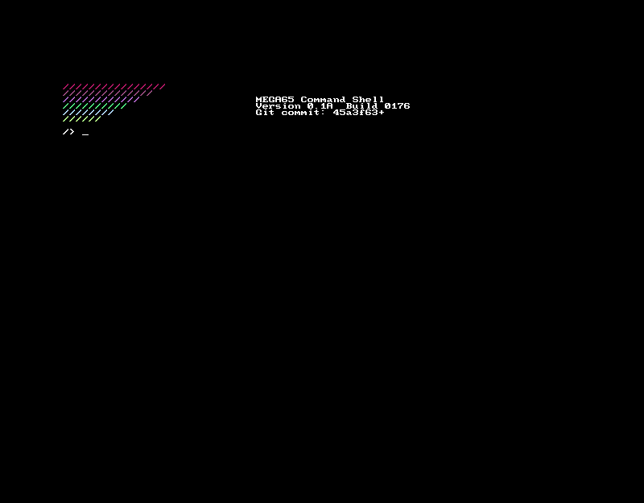

m65sh - for MEGA65
==============================

A command shell that boots in place of the BASIC ROM.

What is in this archive
-----------------------
The layout IS the card's root, so installing is unpacking the archive
there:

  MEGA65.ROM            the shell itself, as the ROM the machine boots
  HICKUP.M65            the hypervisor it needs (see below)
  msh/bin/*.MSH         commands loaded from the card
  msh/etc/init.d/       what runs at boot
  msh/tmp/              scratch
  msh/var/log/          the syslog
  msh/mnt/floppy/       where the disk drive is mounted

Installing
----------
1. Put the card in a PC and unpack the archive at its root. Or, with the
   machine connected over USB serial, push the same files with mega65_ftp
   (from mega65-tools).

2. KEEP A STOCK ROM FIRST, under a held digit. Copy your existing
   MEGA65.ROM to MEGA651.ROM (or MEGA659.ROM) BEFORE overwriting it.

      - the shell's `basic` command and ./prog.prg hand over to it,
       so without one they have nowhere to go.

3. Reboot. The machine loads MEGA65.ROM when no key is held, so it comes
   up in the shell.

About HICKUP.M65
----------------
Hyppo, the MEGA65's hypervisor, is what the shell asks to read and write
the card. The one in older core releases is missing DOS traps the shell
uses - mkdir, rmdir and getcwd among them - and an older Hyppo does not
refuse a call it does not know, it returns nothing and lets the caller
carry on. The machine loads HICKUP.M65 from the card's root at boot.

It is MEGA65's code, not this project's, and it is LGPL-3.0 - see
CREDITS. Remove it if your core is already new enough; the shell's
`traps` command says whether anything it needs is missing.

First steps
-----------
  help            what the commands are
  ls -l           a listing with sizes
  cd games.d81    a .d81 is a directory: cd into it, cd .. to leave
  cat file        print a file
  ./prog.prg      load and run a program
  basic           hand over to BASIC
  traps           check this machine's Hyppo has everything

Anything dropped in /msh/bin becomes a command; `rehash` picks up one
added since boot.

Getting back to a stock machine
-------------------------------
Hold 1 (or 9) at boot for the ROM you saved in step 2. To undo the
install completely, copy that ROM back over MEGA65.ROM.

mv stockrom.rom mega65.rom
